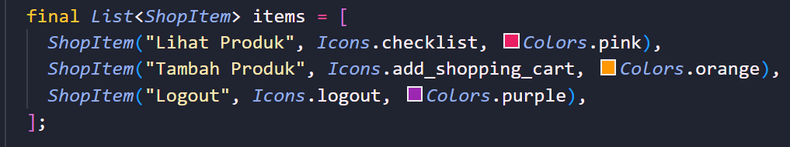
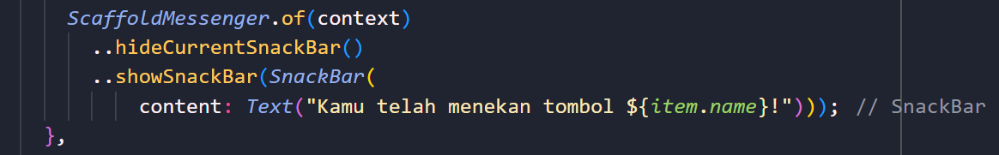

TUGAS 7
1. Apa perbedaan utama antara stateless dan stateful widget dalam konteks pengembangan aplikasi Flutter?
Jawab:
StatelessWidget: Widget yang tidak dapat berubah setelah dibuat. Mereka digunakan untuk bagian dari antarmuka yang bersifat statis, seperti teks atau ikon.

StatefulWidget: Widget yang dapat berubah selama siklus hidup aplikasi. Mereka digunakan untuk bagian dari antarmuka yang bersifat dinamis, seperti daftar yang dapat discroll, input pengguna, atau pembaruan data real-time. 

2. Sebutkan seluruh widget yang kamu gunakan untuk menyelesaikan tugas ini dan jelaskan fungsinya masing-masing.
Jawab:
Pada MyHomePage
---------------
Scaffold: Membungkus seluruh tampilan dengan kerangka dasar aplikasi, termasuk AppBar dan body.

AppBar: membuat bagian atas UI aplikasi (semacam navbar), AppBar juga dapat menampilkan judul aplikasi pada properti 'title', menambahkan button seperti back/next, kustomisasi tampilan seperti 'backGroundColor' atau 'textColor', dll.

Text: menampilkan & kustomisasi teks dalam UI aplikasi. Dalam tugas ini menampilkan teks "Welcome to Obol Bakery >w<" di dalam AppBar.

SingleChildScrollView: memiliki single child di dalamnya. Fungsinya untuk scroll konten melebihi ruang yang tersedia di layar. Walaupun hanya ada single child di dalamnya, banyak widget dapat ditempatkan di dalam single child tersebut dan seluruh konten dalam widget single child tersebut dapat discroll.

Padding: menambahkan padding ke dalam kontennya.

Column: mengatur tampilan vertikal/kolom untuk konten.

Pada ShopCard
---------------
Material: mengatur tampilan background dari komponen-komponen dalam aplikasi. Pada tugas ini, menentukan warna background button.

InkWell: efek untuk membuat area responsif jika button ditekan untuk menampilkan pesan Snackbar.

Container: mengelilingi icon dan teks.

Icon: Menampilkan ikon toko.

Text: Menampilkan nama toko. Pada tugas ini 'Obol Bakery'.

Padding: mengatur padding di sekitar icon dan teks.

3. Jelaskan bagaimana cara kamu mengimplementasikan checklist di atas secara step-by-step (bukan hanya sekadar mengikuti tutorial)
Jawab:
Karena sebelumnya saya belum pernah mencoba membuat aplikasi mobile, awalnya saya agak bingung dan menonton https://youtu.be/VPvVD8t02U8?si=-SY_ylKXwUqx1l5d. Setelah itu saya membaca materi pada website tutorial PBP dan melihat website PBP tahun lalu juga. Kemudian setelah memahaminya, saya menemukan bahwa untuk membuat tombol kita dapat menambahkannya pada bagian 

dan untuk SnackBar pada bagian

--------------------------------------
# obol_bakery

A new Flutter project.

## Getting Started

This project is a starting point for a Flutter application.

A few resources to get you started if this is your first Flutter project:

- [Lab: Write your first Flutter app](https://docs.flutter.dev/get-started/codelab)
- [Cookbook: Useful Flutter samples](https://docs.flutter.dev/cookbook)

For help getting started with Flutter development, view the
[online documentation](https://docs.flutter.dev/), which offers tutorials,
samples, guidance on mobile development, and a full API reference.
